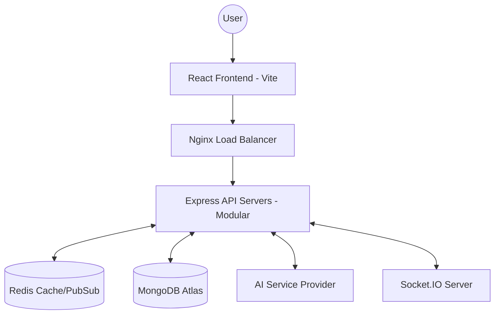

# HeartSync — AI-Powered Premium Dating Platform

[](https://www.typescriptlang.org/)
[](https://reactjs.org/)
[](https://nodejs.org/)
[](https://www.mongodb.com/)
[](https://redis.io/)
[](https://socket.io/)

> **HeartSync** is an elite, production-grade dating platform engineered for high-scale performance, real-time engagement, and AI-driven matchmaking. Built with a focus on system design, distributed real-time communication, and enterprise-level backend practices.

---

## 📑 Table of Contents
- [Project Overview](#-project-overview)
- [System Architecture](#-system-architecture)
- [Tech Stack](#-tech-stack)
- [Scalability & Performance](#-scalability--performance)
- [Database Design](#-database-design)
- [AI & Intelligence](#-ai--intelligence)
- [Security Architecture](#-security-architecture)
- [API & Socket Events](#-api--socket-events)
- [DevOps & Deployment](#-devops--deployment)
- [Installation & Setup](#-installation--setup)
- [Engineering Principles](#-engineering-principles)

---

## 🌟 Project Overview
HeartSync is a demonstration of modern full-stack engineering. It addresses common bottlenecks in dating platforms—such as recommendation latency, real-time state synchronization, and database scalability—using a modular, service-oriented architecture.

### Key Engineering Highlights:
- **Distributed Real-time Engine**: Powered by Socket.IO with a Redis pub/sub adapter for horizontal scaling.
- **Optimized Recommendation Engine**: Leveraging MongoDB GeoJSON and complex aggregation pipelines.
- **AI-Enhanced UX**: Integrated AI for bio generation, chat suggestions, and profile moderation.
- **Enterprise Security**: Strict Zod-based validation, JWT rotation, and rate-limiting.

---

## 🏗 System Architecture

### High-Level System Flow
HeartSync follows a decoupled architecture where the frontend communicates via REST for stateless operations and WebSockets for stateful, real-time interactions.



---

## 🛠 Tech Stack

### Frontend Architecture
| Technology | Usage |
| :--- | :--- |
| **React 18** | UI Library with Functional Components & Hooks |
| **Vite** | Ultra-fast build tool and dev server |
| **TypeScript** | Static typing for enterprise-scale reliability |
| **Redux Toolkit** | Centralized state management for Auth, Chat, and UI |
| **RTK Query** | Sophisticated caching and data fetching layer |
| **Tailwind CSS** | Utility-first styling for premium design |
| **Framer Motion** | High-performance animations and transitions |

### Backend Architecture
| Technology | Usage |
| :--- | :--- |
| **Node.js** | High-concurrency runtime environment |
| **Express** | Robust API framework with modular routing |
| **MongoDB** | Document database for flexible profile structures |
| **Redis** | In-memory store for Caching, Rate Limiting, and Pub/Sub |
| **Socket.IO** | Real-time engine with horizontal scaling support |
| **Zod** | Schema-first validation for API payloads |
| **JWT** | Secure, stateless authentication flow |

---

## 📈 Scalability & Performance

### 1. Horizontal Scaling with Redis
To support high concurrent users, HeartSync utilizes **Socket.IO Redis Adapter**. This allows multiple Node.js instances to share socket events, ensuring seamless communication across a server cluster.

### 2. Database Indexing Strategy
- **Geospatial**: `location: "2dsphere"` for proximity searches.
- **Compound Indexes**: Optimized for `(userId, targetId)` on swipes.
- **Performance**: Prevents collection scans, keeping query times under 50ms.

### 3. The "Unbounded Array" Fix
Avoids storing large arrays (likes/matches) within User documents. Uses relational collection patterns to ensure $O(1)$ performance regardless of user activity volume.

---

## 📡 API & Socket Events

### Core REST Endpoints
| Method | Endpoint | Description |
| :--- | :--- | :--- |
| `POST` | `/api/auth/register` | User registration with Zod validation |
| `POST` | `/api/auth/login` | Secure login with JWT issuance |
| `GET` | `/api/users/discover` | AI-filtered recommendation feed |
| `POST` | `/api/swipes` | Atomic swipe operation (Like/Pass) |
| `GET` | `/api/matches` | Retrieve mutual matches |

### Real-time Socket Events
| Event | Direction | Payload | Description |
| :--- | :--- | :--- | :--- |
| `send-message` | Client -> Server | `{ receiverId, text }` | Sends an encrypted message |
| `receive-message` | Server -> Client | `{ senderId, text, time }` | Real-time message delivery |
| `typing` | Client -> Server | `{ matchId }` | Triggers typing indicator |
| `user-status-changed` | Server -> Client | `{ userId, status }` | Updates online/offline status |

---

## 🧠 AI & Intelligence Architecture
HeartSync implements a **Provider Abstraction Layer**, making it LLM-agnostic.

- **AI Bio Assistant**: Context-aware profile generation.
- **Icebreaker Engine**: Dynamic chat prompts based on shared interests.
- **Safety Layer**: Real-time toxicity detection and content moderation.

---

## 🛡 Security Architecture
- **JWT Auth**: HTTP-only cookies for token storage.
- **Rate Limiting**: Redis-backed sliding window protection.
- **XSS/NoSQLi**: Aggressive middleware sanitization and strict typing.
- **Socket Auth**: Handshake-level JWT verification.

---

## 🚀 DevOps & Deployment

- **Containerization**: Full Docker support with multi-stage builds.
- **Process Management**: PM2 for zero-downtime reloads and monitoring.
- **CI/CD**: GitHub Actions for automated linting, testing, and deployment.
- **Infrastructure**: Vercel (Frontend), Render/VPS (Backend), Redis Cloud (Cache).

---

## 📂 Project Structure

```text
├── client/                # React + Vite Frontend
│   ├── src/features/      # Domain-driven features
│   └── src/store/         # Redux Toolkit global state
└── server/                # Node.js + Express Backend
    ├── src/modules/       # Feature-based modularity
    └── src/socket/        # Real-time event orchestration
```

---

## 🔧 Installation & Setup

### Environment Variables
Create a `.env` in `/server`:
```bash
PORT=5000
MONGO_URI=your_mongodb_uri
REDIS_URL=your_redis_url
JWT_SECRET=your_secret
CLOUDINARY_NAME=your_cloud_name
```

### Quick Start
1. **Install Dependencies**: `npm install` in both `client` and `server`.
2. **Start Backend**: `cd server && npm run dev`.
3. **Start Frontend**: `cd client && npm run dev`.

---

## 🛠 Engineering Principles
- **Service Layer Pattern**: Decoupled business logic from controllers.
- **End-to-End Type Safety**: Shared TypeScript interfaces.
- **Modular Design**: Domain-driven folder structure for easy scaling.

---

## 🎓 Resume Value
- Architected **Scalable Real-time Systems** (Redis + Socket.IO).
- Implemented **Advanced DB Indexing** for Geospatial discovery.
- Built **Modular Frontend Architectures** with RTK Query.
- Integrated **AI Provider Abstractions** for production use.

---

## 👤 Author
**Lalit Mehta**
- [GitHub](https://github.com/Lalitmehta045) | [LinkedIn](https://linkedin.com/in/lalitmehta45)
